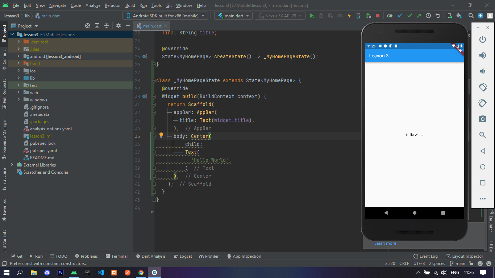
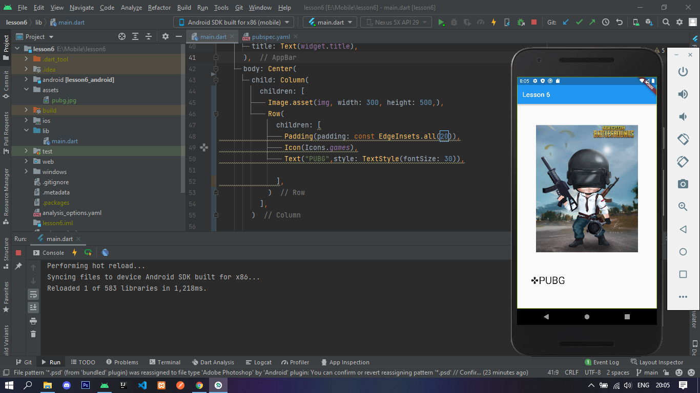
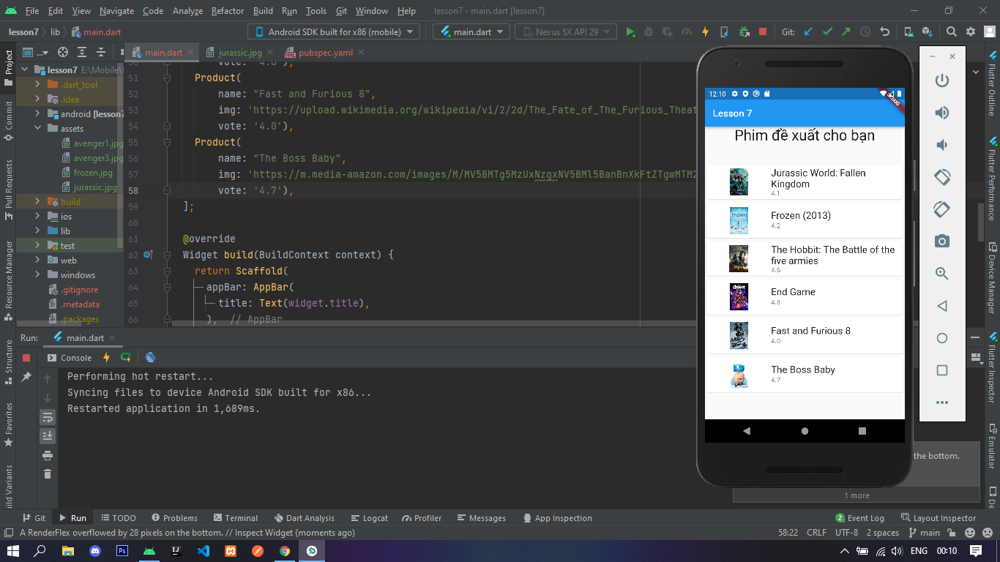
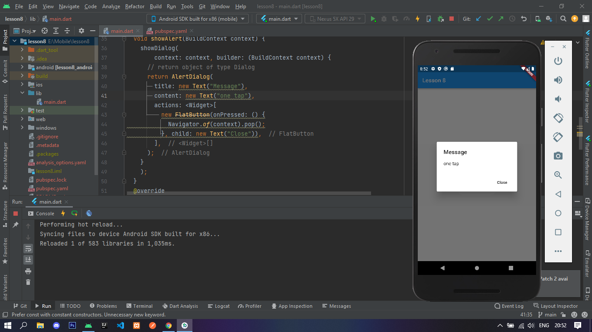
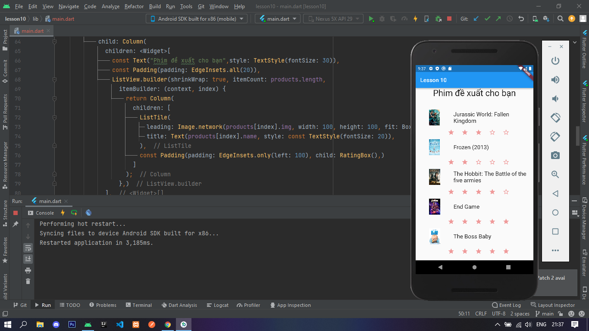
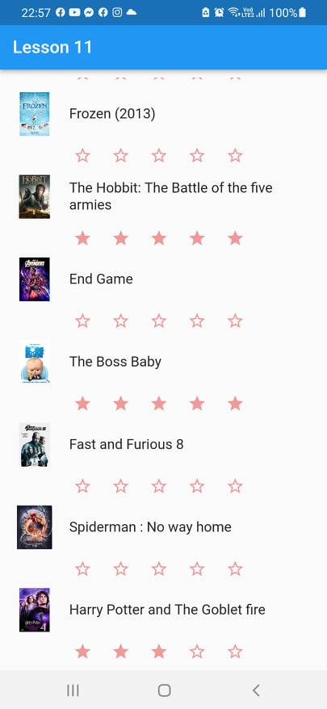

#19021275_Bùi Minh Hiếu

# Quá trình

## Lesson 1: Tìm hiểu về Flutter
## Lesson 2: Cài đặt cấu hình, môi trường cho Flutter
## Lesson 3: Khởi chạy ứng dụng Hello World đầu tiên

## Lesson 4: Tìm hiểu về Widget
## Lesson 5: Tìm hiểu về ngôn ngữ Dart
## Lesson 6: Tìm hiểu về Widget trong Flutter
 - Sử dụng 1 số Widget cơ bản như Scaffold, AppBar, Text, Image, Icon, ...

## Lesson 7: Tìm hiểu về Layout trong Flutter
 - Sử dụng 1 vài Layout cơ bản như ListView, Text, Padding, ListTile, NetworkImage,....

## Lesson 8: Tìm hiểu về Gesture trong Flutter
 - Sử dụng GestureDetector để xử lý sự kiện hiện dialog khi bấm vào ảnh

## Lesson 9: Quản lý trạng thái State
## Lesson 10: Tìm hiểu về Statefullwidget trong Flutter
 - Sử dụng Statefullwidget để người dùng vote phim

## Lesson 11: Tìm hiểu về ScopedModel trong Flutter
 - Sử dụng ScopedModel để thay thế cho Statefullwidget ở lesson 10

## Lesson 12: Tìm hiểu về Navigator và Routing
